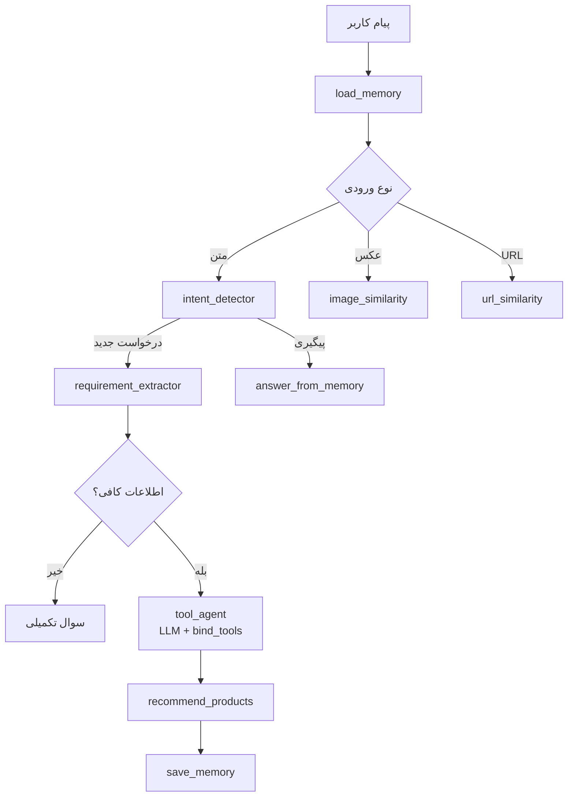

# دستیار فروش هوشمند تلگرام با LangGraph

پروژه کلاسی یک دستیار فروش حرفه‌ای برای فروشگاه آنلاین است که روی تلگرام اجرا می‌شود. ربات به فارسی پاسخ می‌دهد، نیاز مشتری را می‌فهمد، سوال تکمیلی می‌پرسد، محصول پیشنهاد می‌دهد، مقایسه می‌کند و مکالمه را در حافظه نگه می‌دارد.

## ویژگی‌ها

- خواندن محصولات از **CSV یا Excel** (`products_500`) با تشخیص پویای ستون‌ها
- کشف خودکار فایل در پوشه `500-پروداکتs` یا ریشه پروژه
- پارس هوشمند موجودی (`parse_availability`) — «ناموجود» ≠ موجود
- RAG معنایی (Chroma + OpenAI یا keyword/TF-IDF آفلاین)
- فیلتر ساختاری با Pandas (قیمت، برند، دسته، موجودی)
- پیشنهاد ترکیبی (Hybrid) حداقل ۳ محصول
- **Tool Agent** با LLM + `bind_tools` برای search/filter/compare
- سوال پیگیری از پیشنهادهای قبلی **بدون** جستجوی مجدد
- پشتیبانی عکس و لینک محصول خارجی
- **ارسال تصویر محصول** در تلگرام همراه پیشنهاد (`send_photo`)
- فالوآپ ۱ ساعته و تخفیف ۲ روزه
- **`/reset` واقعی** — پاک‌سازی checkpointer LangGraph
- LangGraph: State، مسیریابی شرطی، Tool Calling، Memory، Retry

## معماری

```
app/
├── main.py              # نقطه ورود
├── config.py            # تنظیمات محیطی
├── graph/               # LangGraph workflow
├── tools/               # ابزارهای RAG، Pandas، مقایسه، عکس، URL
├── data/                # بارگذاری CSV، مخزن، وکتور استور
├── telegram/            # ربات تلگرام و Jobها
├── memory/              # Checkpointer و Session Store
└── utils/               # لاگ، Retry، خطا
```

## گردش کار LangGraph



فایل کامل: [`docs/graph.mmd`](docs/graph.mmd)

برای تولید PNG:
```bash
npx @mermaid-js/mermaid-cli -i docs/graph.mmd -o docs/graph.png
# یا بدون Node.js:
python scripts/generate_graph_png.py
```

## محدودیت‌های شبکه (مهم برای محیط شرکتی)

| عملیات | نیاز به اینترنت؟ |
|--------|-----------------|
| **تست‌ها** (`pytest`) | خیر – با `VECTOR_STORE_BACKEND=keyword` کاملاً آفلاین |
| **خواندن CSV/Excel محلی** | خیر |
| **`pip install`** | بله |
| **Chroma + OpenAI / Groq** | بله (اختیاری) |
| **ربات تلگرام** | بله – `api.telegram.org` |
| **دریافت لینک محصول (URL tool)** | بله |
| **ارسال عکس محصول** | بله – placeholder یا `image_url` |
| **دانلود CSV از اینترنت** | بله (اختیاری؛ `force_url=True` فقط URL) |

### پیش‌فرض آفلاین
```env
VECTOR_STORE_BACKEND=keyword
OPENAI_API_KEY=
```
با این تنظیمات، RAG و تست‌ها بدون اینترنت کار می‌کنند.

### حالت آنلاین (اختیاری)
```env
OPENAI_API_KEY=sk-...
VECTOR_STORE_BACKEND=chroma
TELEGRAM_BOT_TOKEN=...
```

## نصب

```bash
git clone <repo>
cd sales-assistant-langgraph-codex
python -m venv .venv
.venv\Scripts\activate        # ویندوز
pip install -r requirements.txt
cp .env.example .env
```

## متغیرهای محیطی

| متغیر | توضیح |
|--------|--------|
| `TELEGRAM_BOT_TOKEN` | توکن ربات تلگرام (اجباری برای اجرا) |
| `OPENAI_API_KEY` | اختیاری؛ بدون آن TF-IDF استفاده می‌شود |
| `FOLLOWUP_1H_SECONDS` | فاصله فالوآپ (پیش‌فرض ۳۶۰۰) |
| `DISCOUNT_2D_SECONDS` | فاصله تخفیف (پیش‌فرض ۱۷۲۸۰۰) |
| `GROQ_API_KEY` | LLM برای Tool Agent و polish پاسخ |
| `USE_LLM` | فعال/غیرفعال LLM (پیش‌فرض true) |
| `CSV_DOWNLOAD_URL` | URL دانلود محصولات (وقتی فایل محلی نیست) |

## اجرا

```bash
python -m app.main
```

## تست

```bash
python -m pytest -v
python -m compileall app
```

تست‌ها بدون توکن تلگرام و بدون OpenAI API key اجرا می‌شوند.

## دمو تلگرام

راهنمای گام‌به‌گام: [`docs/demo_script.md`](docs/demo_script.md)

**پیش از ضبط ویدئو** (بدون تلگرام):
```bash
python scripts/run_demo_simulation.py
```

**تولید تصویر گراف:**
```bash
npx @mermaid-js/mermaid-cli -i docs/graph.mmd -o docs/graph.png
# یا بدون Node.js:
python scripts/generate_graph_png.py
```
فایل خروجی: [`docs/graph.png`](docs/graph.png)

دستورات:
- `/start` — شروع (ریست حافظه)
- `/help` — راهنمای کامل
- `/search <عبارت>` — جستجوی محصول
- `/browse <دسته>` — مرور یک دسته
- `/categories` — لیست دسته‌بندی‌ها
- `/product <id>` — جزئیات محصول
- `/my_products` — آخرین پیشنهادها
- `/reset` — ریست کامل مکالمه + checkpointer
- `/mark_purchased` — ثبت خرید

### قابلیت‌های جدید تلگرام

- بعد از پیشنهاد محصول، تا **۳ عکس** با caption قیمت ارسال می‌شود
- اگر CSV ستون `image_url` نداشته باشد، placeholder پایدار استفاده می‌شود

## داده محصولات

| اولویت | مسیر |
|--------|------|
| 1 | `500-پروداکتs/**/products_500.{csv,xlsx,xls}` |
| 2 | `products_500.csv` در ریشه پروژه |
| 3 | دانلود از `CSV_DOWNLOAD_URL` |

```python
from app.data.product_loader import load_products, parse_availability

# بارگذاری عادی (محلی اول)
df, col_map = load_products()

# فقط از URL — خطا = RuntimeError
df, col_map = load_products(force_url=True)
```

## Tool Agent (LangGraph Tool Calling)

نود `tool_agent` با Groq + `bind_tools` ابزارهای زیر را فراخوانی می‌کند:

- `semantic_search_tool` — RAG
- `filter_by_category_tool` / `filter_by_price_range_tool` / `filter_by_brand_tool`
- `compare_products_tool` / `get_product_by_id_tool`

اگر LLM در دسترس نباشد، خودکار به `hybrid_search` fallback می‌شود.

## RAG + Pandas

| لایه | نقش |
|------|-----|
| **Pandas** | فیلتر سخت: قیمت، برند، دسته، موجودی |
| **RAG** | تطابق معنایی: کاربرد، نیاز، ویژگی‌های کیفی |
| **Hybrid** | ادغام امتیازها، رتبه‌بندی، شل‌کردن تدریجی محدودیت‌ها |

## مفاهیم LangGraph در پروژه

| مفهوم | پیاده‌سازی |
|--------|------------|
| **State** | `SalesAssistantState` در `app/graph/state.py` |
| **Memory** | `MemorySaver` + `thread_id` = شناسه تلگرام |
| **Conditional Routing** | `app/graph/routers.py` |
| **Tool Calling** | `tool_agent_node` با `bind_tools` + ابزارهای LangChain در `app/tools/` |
| **Error Handling** | `error_handler_node` + پاسخ فارسی |
| **Retry** | `app/utils/retry.py` + مسیریابی مجدد به `hybrid_search` / `tool_agent` |

## اسکریپت‌های کمکی

| اسکریپت | کاربرد |
|---------|--------|
| `scripts/run_demo_simulation.py` | تست سناریوهای دمو بدون تلگرام |
| `scripts/generate_graph_png.py` | تولید `docs/graph.png` |
| `docs/demo_script.md` | چک‌لیست ضبط ویدئو |
| `docs/PROJECT_MEMORY.md` | یادداشت پیشرفت پروژه |

## محدودیت‌ها

- بدون API بینایی، تحلیل عکس بر اساس کپشن/متادیتا است
- حافظه در RAM (مناسب دمو)
- پوشه `500-پروداکتs` اختیاری است؛ فعلاً `products_500.csv` ریشه استفاده می‌شود

## بهبودهای آینده

- PostgreSQL checkpointer برای پروداکشن
- مدل Vision برای تحلیل عکس
- پنل ادمین و آنالیتیکس
- پشتیبانی چند فروشگاه

## مجوز

پروژه آموزشی — استفاده آزاد برای کلاس.
