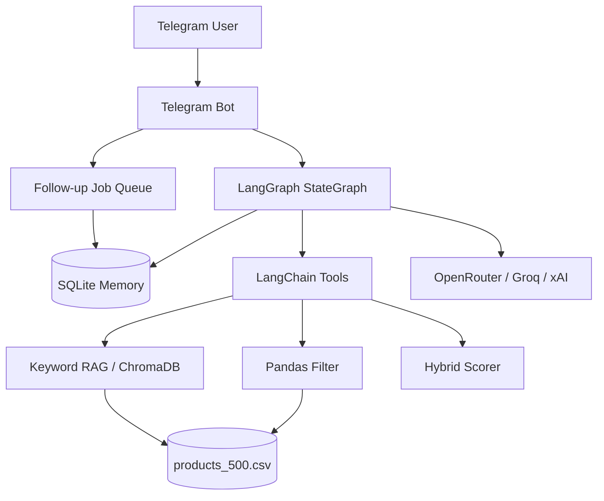
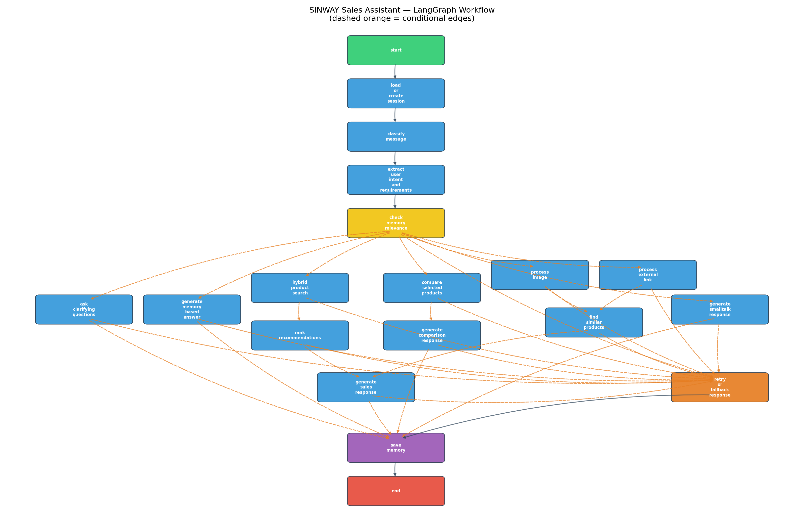

# SINWAY Sales Assistant

دستیار فروش هوشمند تلگرامی برای فروشگاه اینترنتی SINWAY — یک ربات فروشنده‌محور که با **LangGraph**، **RAG** (پیش‌فرض: keyword/hash آفلاین؛ اختیاری: ChromaDB) و **Pandas** محصولات را از فایل CSV پیشنهاد می‌دهد، نیاز کاربر را نیازسنجی می‌کند، از حافظه مکالمه استفاده می‌کند و درباره محصولات قبلی بدون جستجوی مجدد پاسخ می‌دهد.

---

## فهرست

1. [معرفی پروژه](#معرفی-پروژه)
2. [معماری کلی](#معماری-کلی)
3. [تصویر گراف LangGraph](#تصویر-گراف-langgraph)
4. [LangGraph Workflow](#langgraph-workflow)
5. [State Management](#state-management)
6. [Conditional Routing](#conditional-routing)
7. [Tool Calling](#tool-calling)
8. [RAG و Vector Store](#rag-و-vector-store)
9. [Pandas Query](#pandas-query)
10. [Memory](#memory)
11. [Error Handling و Retry](#error-handling-و-retry)
12. [Telegram Bot](#telegram-bot)
13. [نصب](#نصب)
14. [تنظیم `.env`](#تنظیم-env)
15. [اجرای Indexing](#اجرای-indexing)
16. [اجرای Bot](#اجرای-bot)
17. [سناریوهای تست](#سناریوهای-تست)
18. [محدودیت‌ها](#محدودیت‌ها)
19. [مسیر توسعه آینده](#مسیر-توسعه-آینده)

---

## معرفی پروژه

این پروژه یک **فروشنده هوشمند** است، نه یک چت‌بات ساده:

| رفتار | توضیح |
|-------|--------|
| نیازسنجی | اگر کاربر بگوید «یه لپ‌تاپ می‌خوام»، ابتدا بودجه، کاربرد و برند را می‌پرسد |
| پیشنهاد حداقل ۳ محصول | پس از کامل شدن نیاز، با دلیل انتخاب |
| حافظه مکالمه | سؤال درباره «گزینه دوم» بدون query مجدد CSV/RAG |
| به‌روزرسانی جزئی | تغییر بودجه/برند بدون شروع از صفر |
| مقایسه | «گزینه اول و سوم رو مقایسه کن» از حافظه |
| تصویر / لینک | جستجوی محصول مشابه در فروشگاه |
| Follow-up | پیام ۱ ساعته و ۲ روزه با کد تخفیف |

**تکنولوژی‌ها:** Python · LangGraph · LangChain · Keyword RAG / ChromaDB · Pandas · python-telegram-bot · SQLite

---

## معماری کلی

```
SalesAssistant-fable/
├── app/
│   ├── main.py                 # نقطه ورود (bot / index / graph)
│   ├── config.py               # تنظیمات از .env
│   ├── graph/                  # LangGraph: state, nodes, router, builder
│   ├── services/               # LLM, RAG, Pandas, Memory, Recommendation, Follow-up
│   ├── telegram/               # Bot, handlers, formatters
│   ├── tools/                  # LangChain tools (7 ابزار)
│   └── utils/                  # logger, retry, text_normalizer
├── products_500.csv            # کاتالوگ محصولات (۵۰۰ ردیف)
├── tests/                      # ۵۹ تست خودکار (unit / integration / smoke)
├── scripts/demo_scenarios.py   # دمو ۷ سناریوی الزامی
├── graph.png                   # تصویر workflow
├── requirements.txt
├── .env.example
└── README.md
```



---

## تصویر گراف LangGraph



> برای بازتولید: `python -m app.main --graph`

---

## LangGraph Workflow

گراف **۱۷ نود** دارد و هر پیام از مسیر زیر عبور می‌کند:

```
START
  ↓
load_or_create_session
  ↓
classify_message
  ↓
extract_user_intent_and_requirements
  ↓
check_memory_relevance
  ↓
conditional_router
  ├── needs_clarification → ask_clarifying_questions ─────────────┐
  ├── answer_from_memory  → generate_memory_based_answer ─────────┤
  ├── product_search      → hybrid_product_search                 │
  │                          → rank_recommendations              │
  │                          → generate_sales_response ──────────┤
  ├── compare_products    → compare_selected_products             │
  │                          → generate_comparison_response ─────┤
  ├── image_similarity    → process_image → find_similar_products│
  │                          → generate_sales_response ──────────┤
  ├── link_similarity     → process_external_link                 │
  │                          → find_similar_products             │
  │                          → generate_sales_response ──────────┤
  ├── smalltalk           → generate_smalltalk_response ──────────┤
  └── error               → retry_or_fallback_response ───────────┤
                                                                    ↓
                                                     save_memory → END
```

**Checkpoint:** `MemorySaver` از LangGraph برای thread_id = `chat_id`  
**Persistence بلندمدت:** SQLite در `memory_service`

---

## State Management

```python
class SalesState(TypedDict):
    user_id: str
    chat_id: str
    current_message: str
    message_type: Literal["text", "image", "link"]
    user_profile: dict
    requirements: dict          # budget, category, brands, use_case, ...
    missing_slots: list[str]
    conversation_stage: str
    last_recommended_products: list[dict]
    selected_product_ids: list[str]
    last_query_result: list[dict]
    comparison_context: dict
    memory_summary: str
    should_search_products: bool
    should_use_memory: bool
    requirements_changed: bool
    error: Optional[str]
    retry_count: int
    final_response: str
```

| Slot | نوع | توضیح |
|------|-----|--------|
| `category`, `budget` | Hard | بدون آن‌ها پیشنهاد نمی‌دهد |
| `use_case`, `brands` | Soft | یک‌بار پرسیده می‌شود |
| `requirements_changed` | Flag | تغییر بودجه → فقط re-search، نه clarify مجدد |

---

## Conditional Routing

اولویت مسیریابی در `app/graph/router.py`:

1. **error** → fallback
2. **image / link** → مسیر similarity
3. **compare_products** → مقایسه از memory
4. **memory_question** → پاسخ بدون RAG/Pandas
5. **product_request** → clarify یا hybrid search
6. **سایر** → smalltalk

---

## Tool Calling

هفت ابزار LangChain در `app/tools/`:

| Tool | کاربرد |
|------|--------|
| `rag_product_search_tool` | جستجوی معنایی (keyword hash یا ChromaDB) |
| `pandas_filter_products_tool` | فیلتر ساختاریافته (قیمت، برند، دسته، موجودی) |
| `recommend_products_tool` | پیشنهاد ترکیبی (در گراف استفاده می‌شود) |
| `compare_products_tool` | مقایسه گزینه‌های قبلی از memory |
| `get_product_from_memory_tool` | بازیابی محصول معرفی‌شده |
| `similar_products_by_image_tool` | مشابه‌یابی از caption/filename |
| `similar_products_by_url_tool` | fetch لینک + مشابه‌یابی |

---

## RAG و Vector Store

دو backend برای بازیابی برداری (`VECTOR_STORE_BACKEND` در `.env`):

| Backend | کاربرد | توضیح |
|---------|--------|--------|
| `keyword` (**پیش‌فرض**) | dev / demo / Windows | hash n-gram در حافظه — آفلاین، پایدار، بدون ChromaDB |
| `chroma` | production | ChromaDB پایدار در `.data/chroma` |

**Fallback خودکار:** اگر `chroma` انتخاب شده ولی ChromaDB در init یا query خطا بدهد، سرویس به‌صورت خودکار به `keyword` برمی‌گردد (`ResilientRAGService` در `rag_service.py`).

**Pipeline (backend=chroma):**

1. خواندن `products_500.csv` با `ProductCatalog`
2. ساخت `search_text` از نام + دسته + برند + توضیح + ویژگی‌ها + قیمت
3. Embedding و ذخیره در ChromaDB (مسیر: `.data/chroma`)
4. **Hash CSV** در metadata — rebuild فقط در صورت تغییر فایل

**Pipeline (backend=keyword):** همان CSV در حافظه index می‌شود؛ بدون فایل Chroma و بدون دانلود مدل.

**Embedding modes** (فقط برای Chroma):

| Mode | توضیح |
|------|--------|
| `hash` (پیش‌فرض) | n-gram hashing — آفلاین، بدون دانلود مدل |
| `onnx` | MiniLM ONNX از Chroma |

**Metadata هر document:** `product_id`, `name`, `brand`, `category`, `price`, `availability`, `image_url`, `product_url`

---

## Pandas Query

`PandasQueryService` فیلترهای دقیق را اعمال می‌کند:

- سقف/کف قیمت (`effective_price` با تخفیف)
- برند، دسته‌بندی
- موجودی (`stock > 0`)
- امتیاز (`rating`)
- مرتب‌سازی: `price` | `rating` | `match`

**Relaxation:** اگر نتیجه دقیق نبود، به‌تدریج فیلترها شل می‌شوند (`relaxed` در خروجی).

**Hybrid Scoring:**

```
final_score =
  0.40 × semantic_similarity
+ 0.25 × budget_match
+ 0.15 × use_case_match
+ 0.10 × brand_match
+ 0.10 × availability
```

---

## Memory

SQLite در `.data/memory.sqlite`:

| Table | محتوا |
|-------|--------|
| `user_sessions` | requirements, stage, summary, focus, purchase_status |
| `recommended_products` | snapshot محصولات + position (گزینه ۱/۲/۳) |
| `followups` | زمان‌بندی idle_1h و purchase_2d |

**قانون طلایی:** سؤال درباره محصول قبلی → `get_product_from_memory_tool` → **بدون** CSV/RAG/Pandas.

---

## Error Handling و Retry

`app/utils/retry.py` — decorator با exponential backoff برای:

- LLM calls
- Telegram API (در handlers)
- Vector DB query
- CSV loading
- HTTP fetch (لینک محصول)

اگر خطا باقی بماند، نود `retry_or_fallback_response` پاسخ طبیعی می‌دهد:

> «الان برای بررسی دقیق محصول مشکلی پیش اومده، اما می‌تونم با اطلاعاتی که ازت دارم راهنمایی‌ات کنم.»

---

## Telegram Bot

| قابلیت | Command / Handler |
|--------|-------------------|
| شروع | `/start` — خوش‌آمد و معرفی کوتاه |
| راهنما | `/help` — خلاصه قابلیت‌ها و دستورات |
| دسته‌بندی‌ها | `/categories` — لیست دسته‌های موجود در کاتالوگ |
| ریست مکالمه | `/reset` — پاک کردن کامل حافظه SQLite و checkpoint گراف برای این چت |
| خرید | `/mark_purchased` — فعلاً فقط اطلاع‌رسانی؛ پرداخت آنلاین به‌زودی فعال می‌شود |
| متن | `handle_text` → LangGraph |
| عکس محصول | بعد از پیشنهاد بگو «عکس گزینه‌ها رو بفرست» — از حافظه، بدون جستجوی مجدد |
| عکس ورودی | `handle_photo` → جستجوی مشابه از caption |
| لینک | تشخیص URL در متن |
| Proxy | `TELEGRAM_PROXY` در `.env` |
| Follow-up | Job queue هر ۶۰ ثانیه |

**شخصیت بات:** «سینا» — فارسی، فروشنده حرفه‌ای، خلاصه، با پیشنهاد اقدام بعدی.

---

## نصب

```bash
# 1. کلون / ورود به پوشه پروژه
cd SalesAssistant-fable

# 2. محیط مجازی
python -m venv .venv
# Windows:
.venv\Scripts\activate
# Linux/macOS:
source .venv/bin/activate

# 3. وابستگی‌ها
pip install -r requirements.txt

# 4. تنظیم env
copy .env.example .env   # Windows
# cp .env.example .env   # Linux/macOS
# سپس مقادیر را پر کنید
```

---

## تنظیم `.env`

```env
LLM_PROVIDER=openrouter
USE_LLM=true
OPENROUTER_API_KEY=sk-or-v1-...
OPENROUTER_MODEL=openai/gpt-4.1-mini
TELEGRAM_BOT_TOKEN=...
TELEGRAM_PROXY=http://127.0.0.1:10808   # اختیاری؛ خالی بگذارید اگر proxy ندارید
PRODUCTS_CSV_PATH=products_500.csv
VECTOR_DB_PATH=.data/chroma
VECTOR_STORE_BACKEND=keyword   # پیش‌فرض پایدار؛ برای production: chroma
MEMORY_DB_PATH=.data/memory.sqlite
EMBEDDING_MODE=hash
FOLLOWUP_IDLE_SECONDS=3600
FOLLOWUP_PURCHASE_SECONDS=172800
DISCOUNT_CODE=SALE10
LOG_LEVEL=INFO
```

| متغیر | پیش‌فرض | توضیح |
|-------|---------|--------|
| `VECTOR_STORE_BACKEND` | `keyword` | `keyword` = آفلاین/پایدار؛ `chroma` = ChromaDB + fallback خودکار به keyword |
| `USE_LLM` | `true` | `false` = rule-based extraction و پاسخ deterministic |
| `OPENROUTER_MODEL` | `openai/gpt-4.1-mini` | مدل OpenRouter |
| `FOLLOWUP_IDLE_SECONDS` | `3600` | follow-up بعد از بیکاری (ثانیه) |
| `FOLLOWUP_PURCHASE_SECONDS` | `172800` | follow-up بعد از خرید (ثانیه) |

> **هشدار:** کلیدهای API را در repository commit نکنید. فقط `.env.example` با placeholder.

**حالت آفلاین (بدون LLM):** `USE_LLM=false` — rule-based extraction و پاسخ‌های deterministic.

**Vector store:** با `VECTOR_STORE_BACKEND=keyword` (پیش‌فرض) نیازی به `--index` نیست. برای production با Chroma: `VECTOR_STORE_BACKEND=chroma` و سپس `python -m app.main --index`.

---

## اجرای Indexing

```bash
# فقط وقتی VECTOR_STORE_BACKEND=chroma
python -m app.main --index
```

ChromaDB در `.data/chroma` ساخته/به‌روز می‌شود. اگر CSV تغییر نکرده باشد، rebuild رد می‌شود. با backend=`keyword` این مرحله اختیاری است.

---

## اجرای Bot

```bash
python -m app.main
```

Bot در startup سه سرویس را warm-up می‌کند: catalog، vector index، graph.

---

## سناریوهای تست

### اجرای تست‌های خودکار

```bash
python -m compileall app
pytest -m "not integration" -v
pytest -m integration -v
pytest -m smoke -v
```

**نتیجه آخرین اجرا (Windows, Python 3.10):**

| Suite | تعداد | نتیجه |
|-------|-------|--------|
| `not integration` | 43 | همه passed |
| `integration` | 16 | همه passed |
| `smoke` | 1 | passed |
| **جمع** | **59** | **59 passed** |

### دمو تعاملی (۷ سناریوی rubric)

```bash
USE_LLM=false VECTOR_STORE_BACKEND=keyword python -m scripts.demo_scenarios --no-chroma
```

`--no-chroma` backend keyword را force می‌کند (پیش‌فرض پایدار روی Windows). برای تست Chroma: `python -m scripts.demo_scenarios --chroma`.

| # | ورودی کاربر | رفتار مورد انتظار |
|---|-------------|-------------------|
| 1 | «یه لپ‌تاپ می‌خوام» | سؤال تکمیلی، **بدون** پیشنهاد محصول |
| 2 | «لپ‌تاپ تا ۵۰ میلیون برای برنامه‌نویسی…» | ≥۳ محصول + دلیل |
| 3 | «گزینه دوم رمش چقدره؟» | پاسخ از memory، بدون re-search |
| 4 | «بودجه‌ام شد ۴۰ میلیون» | update بودجه، حفظ category/use_case |
| 5 | «گزینه اول و سوم رو مقایسه کن» | جدول/خلاصه مقایسه |
| 6 | `https://example.com/...` | ≥۳ جایگزین داخلی |
| 7 | ارسال عکس | با caption → جستجو؛ بدون caption → سؤال fallback |

---

## محدودیت‌ها

| موضوع | توضیح |
|-------|--------|
| Vision | تحلیل تصویر از caption/filename — CLIP پیاده نشده (fallback مستند) |
| ChromaDB روی Windows | برخی buildها ناپایدارند — `keyword` پیش‌فرض است؛ fallback خودکار به keyword |
| Embedding hash | برای فارسی کافی است؛ ONNX دقیق‌تر ولی انگلیسی‌محور |
| CSV synthetic | برخی برند/مدل‌ها غیرواقعی (داده تست) |
| پرداخت | follow-up و کد تخفیف شبیه‌سازی — خرید آنلاین هنوز فعال نیست؛ پیام «به‌زودی» |
| SSL fetch | لینک‌های خارجی ممکن است fail شوند → fallback از slug URL |

---

## مسیر توسعه آینده

- [ ] CLIP / embedding تصویری واقعی
- [ ] Vision LLM (GPT-4V) برای عکس بدون caption
- [ ] Redis checkpoint برای scale افقی
- [ ] Admin panel برای CSV و analytics
- [ ] A/B testing روی hybrid weights
- [ ] Webhook mode به‌جای polling
- [ ] پشتیبانی چند فروشگاه / multi-tenant

---

## لایسنس

پروژه آموزشی/ارزیابی — SINWAY Sales Assistant.
